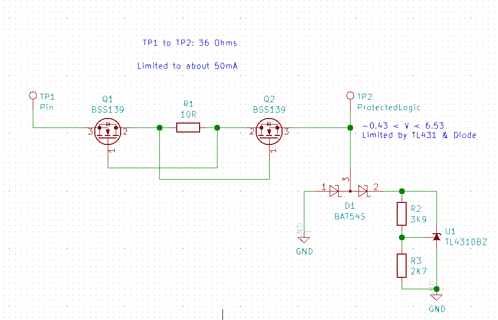

# io-protection-notes

Lab notes from developing an io protection circuit for [Glasgow](https://github.com/GlasgowEmbedded/Glasgow)

### Basic idea

  - basic tests positive
  - tested with permanent +-30v
  - voltage limit is thermal

### RF testing

[see here](rf-tests/README.md)

### Vio discharge simulation

[see here](vio-discharge-sim/README.md)

### Diode selection

[see here](diode-selection/README.md)

### ESD protection

[see here](esd-protection/README.md)
