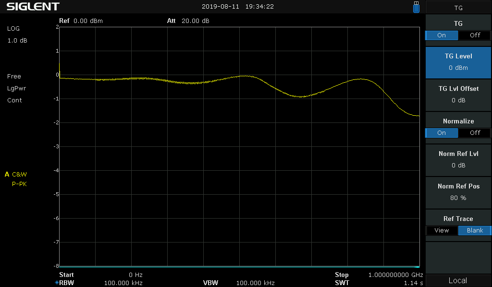
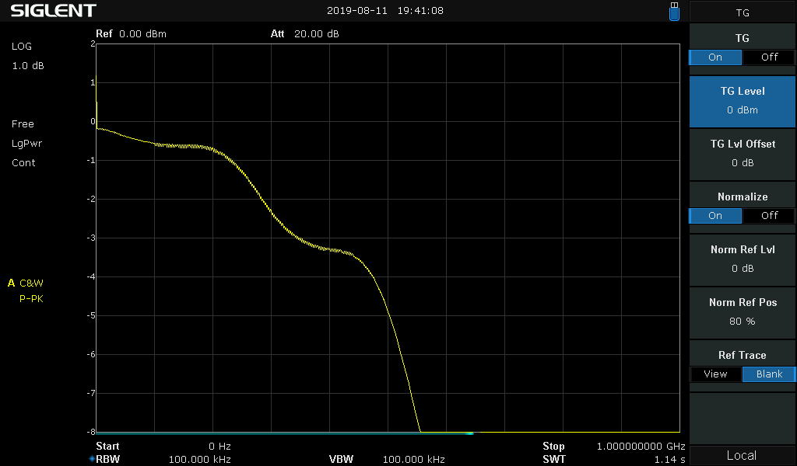
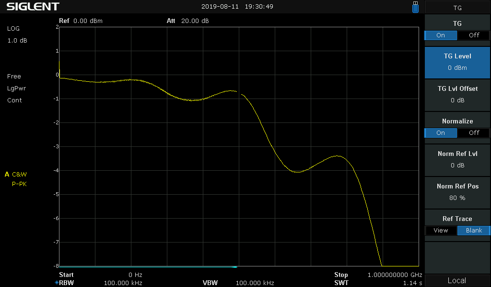
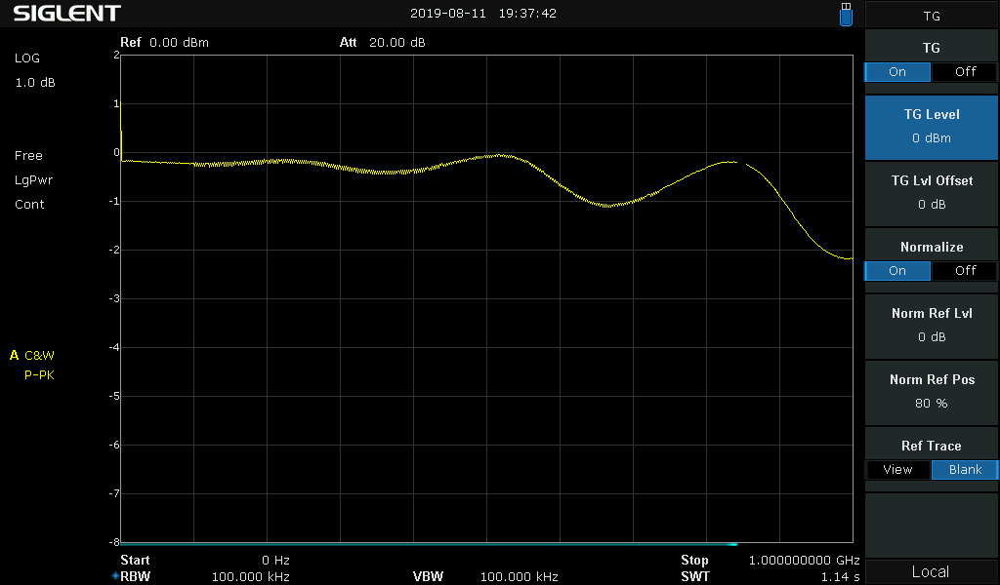
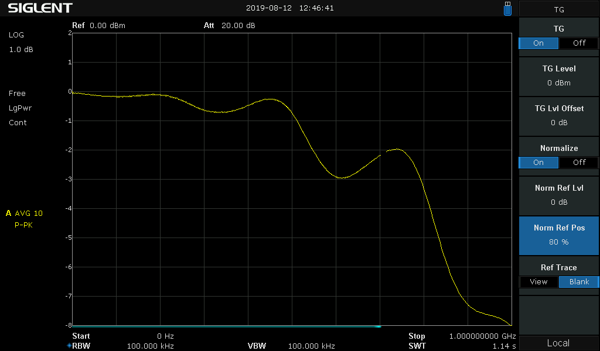

# Diode Selection

In [RF testing](../rf-tests/README.md) I found out that the type of diode used for D1 of my basic schematic
has big impact on the insertion loss at RF. So I wanted to do further tests with different diodes.

### Diode Requirements

   - Low capacitance for low RF loss
   - more than 100 mA continuous forward current in the datasheet (we use about 50 mA in practice, but the datasheet values do not include heating effects, so we want some margin)
   - Reverse breakdown voltage > 7 V (the diodes are behind the limiter)
   - Low forward voltage at 50 mA: the absolute maximum rating for negative input voltage of the 74LVC1T45 used on the input of Glasgow is -0.5 V. The farther below -0.5 V we go, the more we risk permanent damage. The current is limited to 50 mA by the FETs, so this is the actual current occuring when the circuit is active.
   
### Test Setup

   - Similar as in [RF testing](../rf-tests/README.md)
   - Diode measured behind the two protection FETs and resistor to get realistic results
   - I increased the TG output to 0 dBm to be more realistic
   - Reference plot set as 0 dB is the protection circuit on the circuit board without any diode
   - No changes after getting the reference plot, so no "uncal" annunciator
   - Forward voltage measurement is done with a 50 mA current reference and a multimeter directly connected across the diode
   - Tests done at room temperature at about 25°C

### Diode Tests

##### BAS40-04

   - Infineon
   - allows 120 mA
   - claim 3 pF at 0 V and 1 MHz
   - Measured Vf at 50 mA: 0.72 V
   - -3 dB at about 930 MHz

##### BAS70-04-E3-18

   - Vishay
   - allows 200 mA (other manufacturers only specify 70 mA)
   - claim 1.5 pF at 0 V and 1 MHz
   - Measured Vf at 50 mA: 0.85 V
   - -3 dB > 1 GHz

##### BAT42W-G3-08

   - Vishay
   - allows 200 mA
   - claim 7 pF at 1 V and 1 MHz
   - Measured Vf at 50 mA: 0.55 V
   - -3 dB at about 350 MHz

##### BAT64-04

   - Infineon
   - allows 250 mA
   - claim 4 pF at 1 V and 1 MHz
   - Measured Vf at 50 mA: 0.49 V
   - -3 dB at about 590 MHz

##### BAV99

   - Diodes Inc.
   - allows 300 mA
   - claim 2 pF at 0 V and 1 MHz
   - Measured Vf at 50 mA: 0.79 V
   - -3 dB > 1 GHz
   - Re-measured with the same setup to really allow comparison

##### MMSD301T1G

   - ON Semi
   - allows 200 mA
   - claim 0.9 pF at 0 V and 1 MHz
   - Measured Vf at 50 mA: 0.8 V
   - -3 dB > 1 GHz

### Improved Measurement

After doing the above measurements, I came to the conclusion that the measurement method used is a bit flawed,
because the sinusoid output of the tracking generator is centered around GND. So the measurement signal goes negative,
which a real CMOS data signal from/to Glasgow would not. At 0 dBm and 50 Ohms the measurement signal has 0.316 Vpeak. This
goes near the voltage where a Schottky diode would begin to conduct and thus influence the measurement.

To fix that, I added RF DC blockers to the output of the tracking generator and input of the spectrum analyzer. Then
I biased the signal to +0.3 V (0.6 V from my lab supply, injected through a voltage divider 3k3 / 3k3).

With this setup I repeated the measurement of the BAT64:

The insertion loss above 600 MHz improved significantly. But above 500 MHz the BAT64 and BAV99 are still worlds apart.

### Conclusion

   - BAV99 has the lowest impact on RF performance
   - Further testing needs to be done with actual 74LVC1T45 at -0.79V input, also together with the diodes in the actual circuit
   - If the 74LVC1T45 degrade or get damaged by -0.79V, the BAT64 would be the best alternative
   
   
