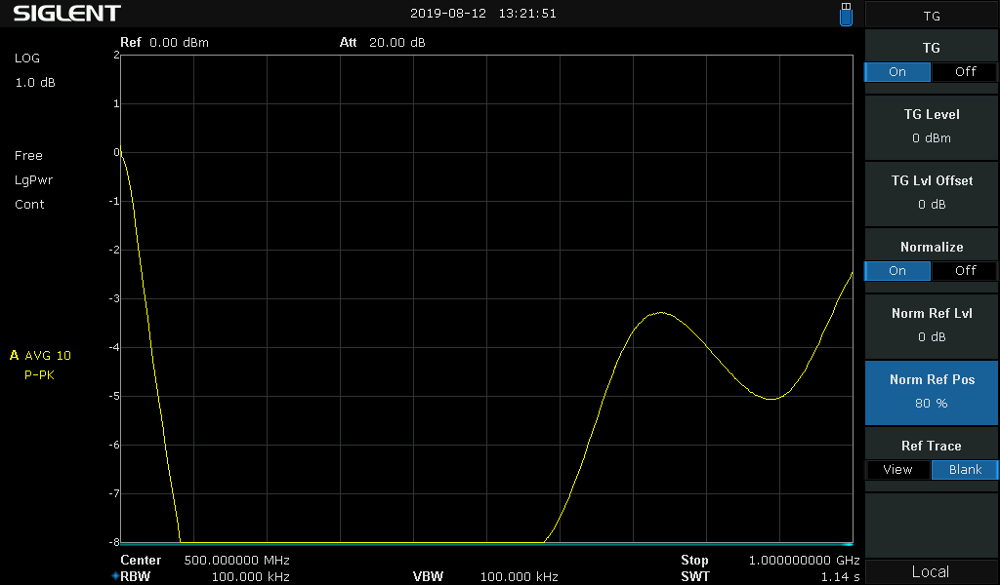
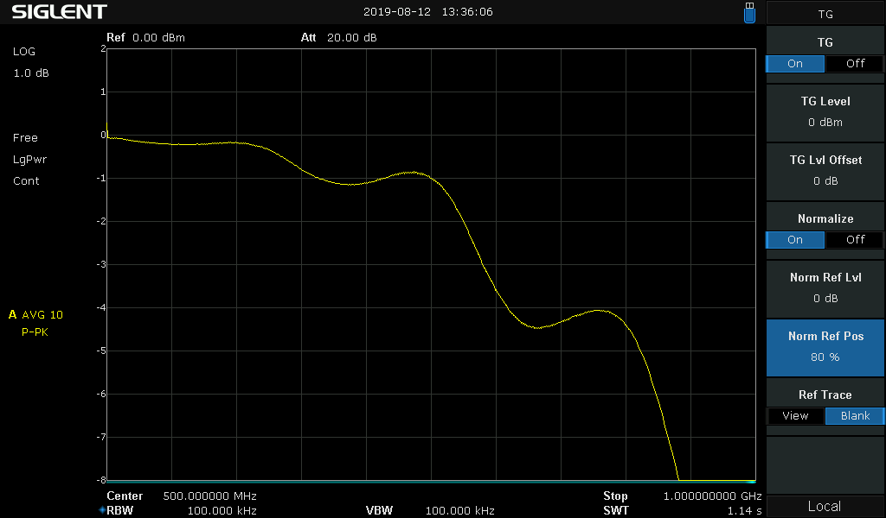
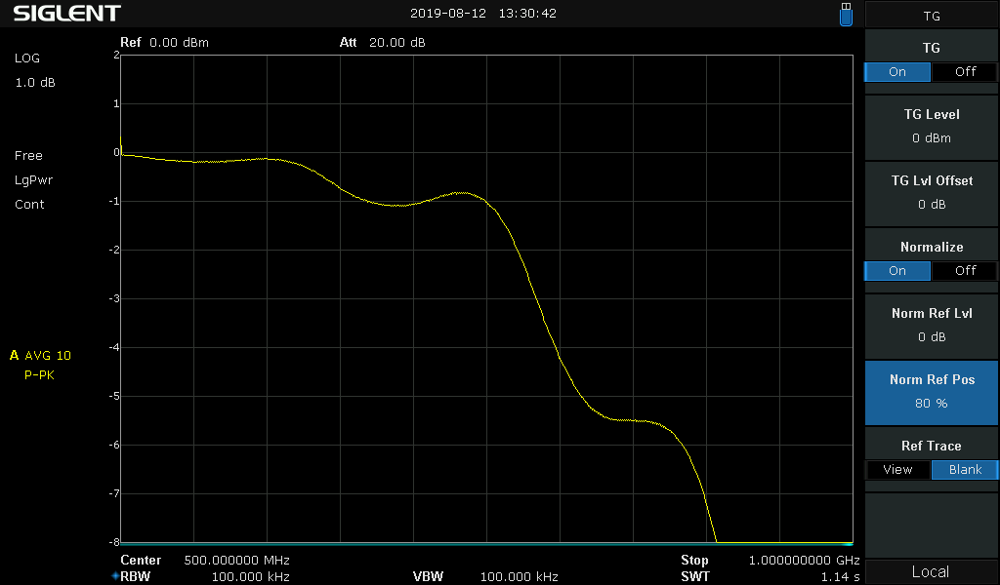
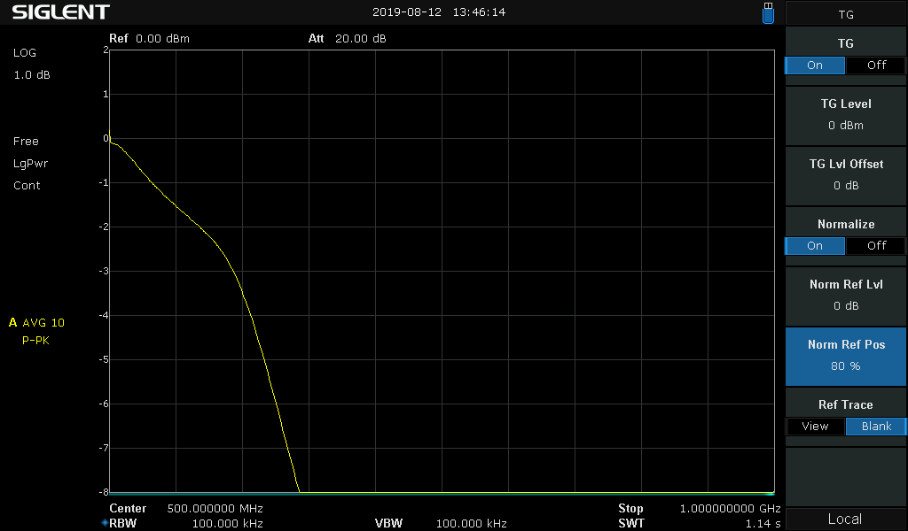
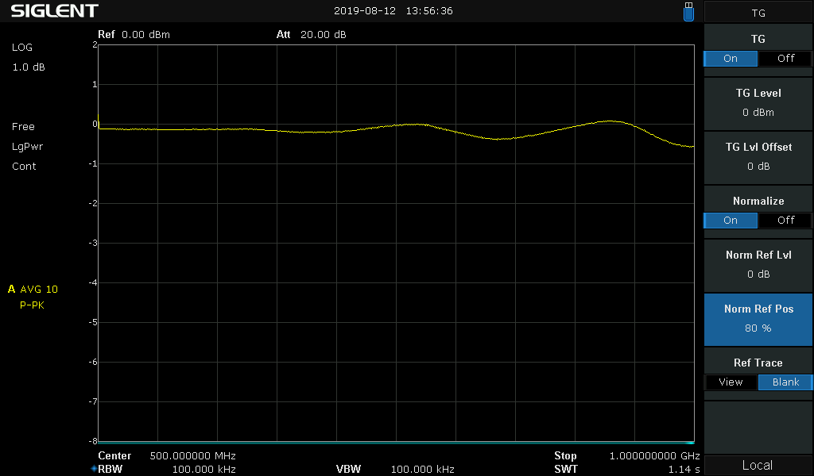

# ESD Protection

The BSS139 FETs are rated as ESD class 0, meaning less than 250 V HBM. So additional ESD protection
is mandatory.

### TVS Diode Requirements

   - Low capacitance for low loss at RF
   - Bidirectional
   - Reverse standoff voltage > 30 V (the io protection board allows up to +- 30V DC)
   - Maximum clamping voltage < 250 V (drain-source breakdown of the BSS139)
   - ESD air and contact protection > 15 kV
   - At least some protection against 8/20 µs surges

### Test Setup

   - Similar as in [RF testing](../rf-tests/README.md)
   - The TVS diodes will be installed at the outside pin (TP1) in the end. But to test worst case conditions, we need to measure what the Glasgow level shifter sees behind the protection FETs.
   - So for this test, the TVS diodes will be installed instead of D1 in the schematic
   - TG output at TP1, measurement at TP2
   - Reference plot set as 0 dB is the FETs and resistor on the circuit board without any diode

### TVS Diode Tests

##### SMAJ18CA

   - 2 of them in series to get appropriate breakdown voltage and reduce capacitance
   - Not designed for data lines
   - Had them in my parts bin, just wanted to see how they compare to others
   - 2 SMA footprints is a bit large for the protection board

##### BZB100A

   - Not really designed as TVS diode, so no high ESD ratings
   - working voltage of about 100 V is a bit high

##### PESD24VL1BA

   - 2 of them in series to get appropriate breakdown voltage and reduce capacitance
   - ESD protection 23 kV contact
   - 200 W surge protection

##### SP3130

   - Explicitly designed for data lines
   - Standoff voltage of 28 V is a bit low
   - lowish ESD protection level (10 kV contact, 15 kV air)
   - no surge protection rating
   - small 0402 footprint

##### CDSOD323-T36SC

   - Reverse standoff voltage 36 V
   - ESD protection 30 kV contact and air
   - 400 W surge protection
   - Not really designed for fast data lines

##### NUP1301U and CDSOD323-T36SC

   - NUP1301U is a ESD protection diode array in series configuration
   - Not Z diodes, but regular diodes, designed for clamping ESD to the power rails
   - Low capacitance of 0.6 pF at 0 V
   - ESD protection 30 kV contact
   - Peak surge pulse 11 A (8/20 µs) is above that of the CDSOD323-T36SC
   - I use them in series with the CDSOD323-T36SC to "shield" the capacitance of the CDSOD323-T36SC
   - Measured breakdown (1 mA) of the combination under DC conditions: 44.3 V

### Conclusion

   - The SP3130 has nearly no impact on the RF performance and is small, but it also just provides a very basic protection level
   - The combination of NUP1301U and CDSOD323-T36SC provides a similar RF performance, but also offers a good ESD and surge protection level. One SOT323 and one SOD323 are still a reasonable size for ESD protection per pin.
