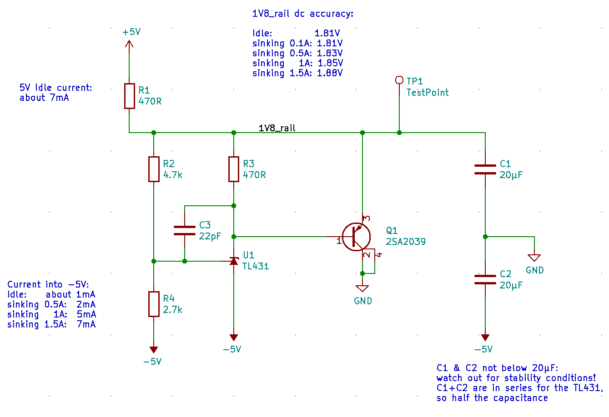
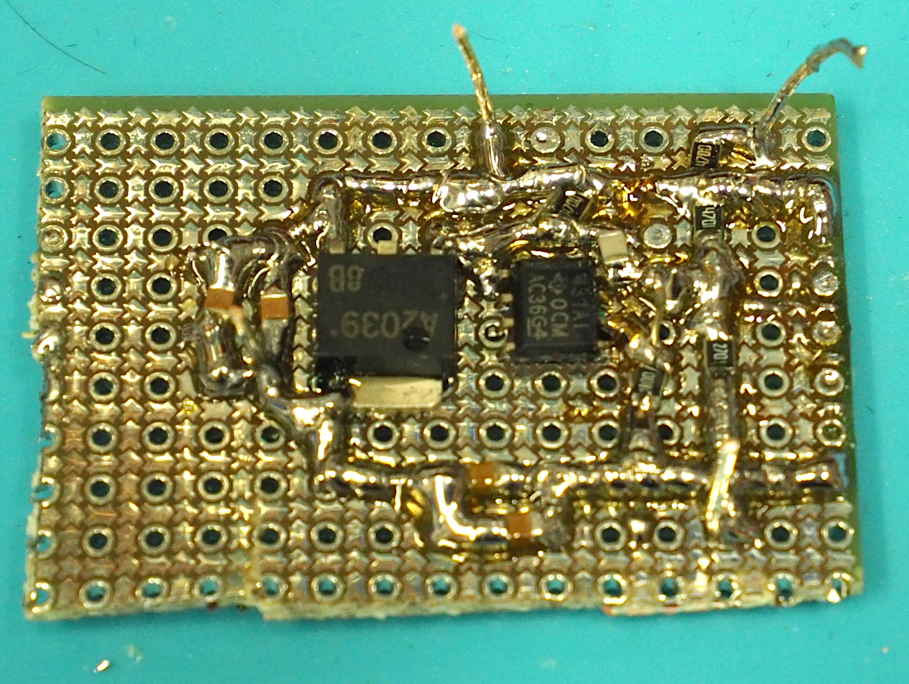

# Power Shunt

This circuit discharges any current that might drive a power or protection rail above the programmed
value. Base design adapted from the application examples in the datasheet of the TL431.

This circuit was developed and tested primarily for the 1.8V output protection rail of Andrew Zonenbergs 
[Oscilloscope Frontend](https://github.com/azonenberg/starshipraider/tree/master/boards/entry-afe-characterization).
But a similar circuit will probably also be used in the IO protection board to discharge current from pins set
to input (opposed to output high ones, which will discharge through [vio-discharge](../vio-discharge-sim/README.md)).

I initially planned to use TLV431, but their feedback voltage of 1.25V and the Vbe of the transistor were too close
to the target of 1.8V, leaving not enough voltage to regulate. As the AFE board already has negative voltage rails,
I used -5V for the anode and current through the TL431 itself, giving it plenty of room to regulate. The
actually discharged current flows from 1.8V through the power transistor to ground.

### Schematics

### Power Transistor

I chose ON Semi 2SA2039-TL-E in TO-252 for easy heat dissipation and to have enough headroom for all the channels 
on the IO protection board. When chosing a different part, primarily look for high bandwidth and low output 
capacitance to get a fast enough discharge action.

### Resistors

   - R1 sets the idle current. Chose enough for the minimum regulation current of the TL431 and a few mA to let the
     transistor begin to conduct. A higher idle current speeds up initial discharge action.
   - R2 / R4 set the target voltage, feedback voltage is 2.495V above the -5V rail
   - R3 gives the TL431 the minimum regulation current but also biases the Vbe of the transistor. Check R3 resistance
     when changing target voltage. Check C3 size when changing R3.

### Capacitors

   - C1 and C2 are the main output capacitors for the regulator
   - As the TL431 is connected to the negative rail, it sees both caps in series, so the effective value is divided by 2
   - Watch out for the minimum stability values specced in the datasheet of the actual TL431 you are using:
     this value differs by manufacturer and model of the TL431!
   - C3 is needed for stability to compensate for the phase lag of the power transistor. Experimentation showed
     that the circuit is stable down to 4.7pF. With 22pF there is enough headroom.
   - The more capacitance in C3, the more phase margin, but it also slows down regulation

### Prototype

I used my [protoboard](https://github.com/electroniceel/protoboard) to build a small prototype:

I do not recommend to use TL431 in SO-8, I just wanted to use up the ones I once misordered.

### Testing

See comments in the schematics for the results of DC testing.

After the DC measurements were done, I remembered that I did measure the 1V8_rail DC accuracy through
the same pin I injected the current through. The voltage drop on that pin probably accounts for most 
of the differences measured. So the actual circuit is probably much better than stated.

#### PSU touch

I touched a wire connected to the positive rail of a lab PSU (set to 5V and 250mA) to the 1.8V rail:

The trace shows the AC coupled 1.8V rail.

After the contact chatter you see the small output cap of the lab PSU discharge and afterwards the two
regulators fighting each other until the lab PSU gives up and changes to CC mode. The voltage curve 
differs vastly between my different lab PSUs models, this supports this conclusion.

#### Cap touch

I charged a 0.47µF foil cap to 5V and immediately touched it to the 1.8V rail:

The traces show the AC coupled 1.8V rail in different time resolutions.

After the contact chatter you see the voltage rising to about 100mV in about 1µs. After this time the
regulator sinking the current wins against the capacitor. The overshoot of the regulator is done after
about 4µs and the ringing after about 50µs. Because of the low idle current through R1 it takes some
time to reach the target voltage again.

As this circuit is designed for protection sinking and not for delivering a stable output voltage, this
overshoot is acceptable and preferable over a slower initial sink reaction.
