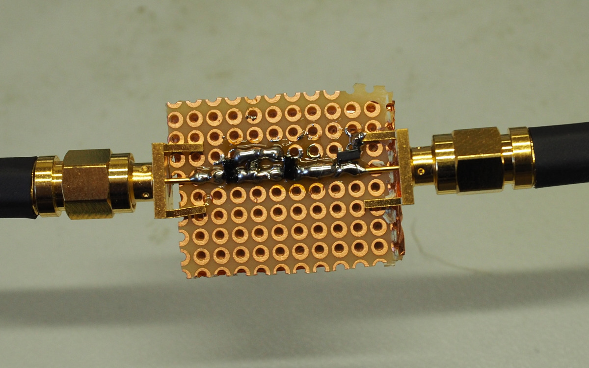

# RF testing

There was some concern that the protection could impact signal integrity at high speeds. So
I did some tests with a spectrum analyzer with tracking generator.

### DUT

  - small scrap of protoboard
  - copper foil on the back as ground plane
  - side mount SMA connectors

### Baseline

  - No diodes or other components yet
  - just straight through connection between the SMAs
  - compared to a proper SMA through

Results:

  - not too shabby up to 1 GHz
  - but already a wobble of about 1 dB down just because of the non-optimal transmission line over about 3 cm

I used this as reference for all further measurements, so this result is set as 0 dB there.

### Diodes

Because of a hunch I tested just adding the diode to ground first, no protection fets yet.

#### BAT54

As I already guessed this makes a shitty rf diode. Already 3 dB down at 556 MHz. 
Note that I had to rescale the amplitude to make it fit the screen.

#### BAV99

These are my first go-to diodes if I want to replace BAT54 without the downsides of Schottky.
RF performance much better.

But I don't know if the higher forward Voltage of silicon diodes isn't a problem when protecting
against negative voltages. The internal protection diodes of the level shifters could begin to
conduct at about the same voltage level.

TODO: test negative voltage performance with BAV99 and 74LVC1G45.

### Protection circuit

Diode, 2 depletion FETs and 10R, like in the [original schematic](../initial-schematics/schematics.png).
Without the TL431 as it won't impact rf performance (too low peak voltage to activate it).

  - at DC you see the 36 ohms
  - with higher freq the attenuation slowly drops, capacitive coupling starts to become a thing
  - slight wobbles with 1.37 dB max
  - same order of magnitude as just the degradadtion due to the test board

I would consider this a success, the effects are minimal and about the same as due to wiring or signal routing.

### Test setup

The DUT is shown with the protection circuit installed. I reworked it during the progress of the test.
