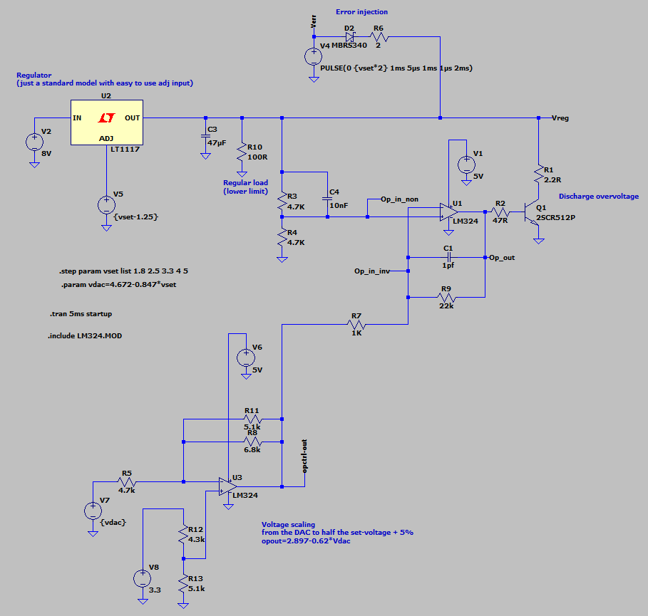
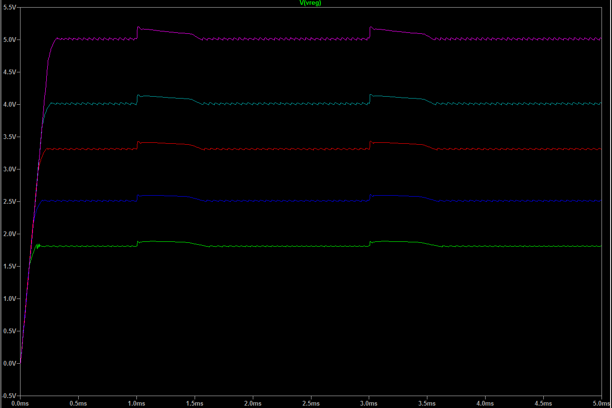

# Vio discharge simulation

### The problem

When current is injected backwards into one or more 74LVC1G45 level shifters set to output high,
Vio can rise above the programmed value. This could damage circuits connected to other pins
on the same port.

The best solution to prevent this would be a voltage regulator which can source and sink current. But these are
rare, expensive and not available with such a low dropout as the TPS73101.

The second best solution is to burn the excess voltage once it reaches a certain point above the
programmed value with a transistor. There has to be a gap between the programmed value and the value
where the transistor starts to conduct, otherwise the control loop of the voltage regulator could be
disturbed. I chose 5%.

### Simulation

Simulation was done in LTSpice.

Source files: [vio-discharge.asc](vio-discharge.asc) 
[LM324.MOD](LM324.MOD) 

 * U1 controls the discharge resistor Q1
 * U1 senses Vio through R3/R4
 * U1 compares Vreg/2 because of the limited allowed common mode voltage of the LM324
 * U3 scales and shifts the voltage from the DAC on Glasgow
 * Output of U3 is the wanted (Vio + 5%) / 2
 * U3 uses a inverting configuration, but with a fixed offset voltage and not GND on the
   non-inverting input

 * The error signal is injected by V4
 * Through a diode and resistor to simulate worst-case values on Glasgow (all pins affected)
 * The error pulse rises sharply (5µs) and decays over 1ms
   
### Results

 * The response looks good to me, just a little overshoot and no oscillation
 * Ignore the oscillation of the voltage regulator in idle state, this is just due to the crude
   adjustment of the simulated LT1117

